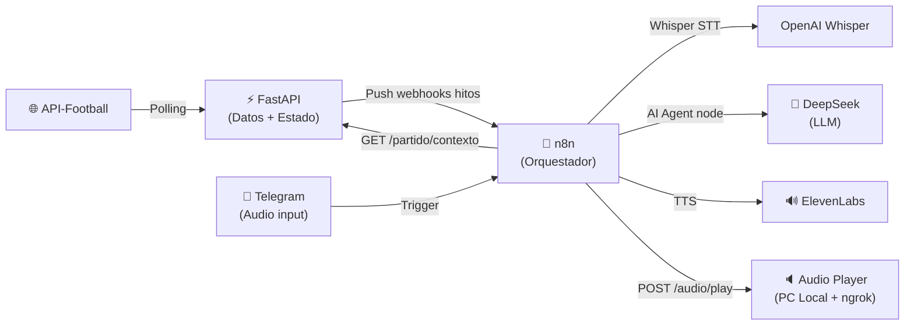
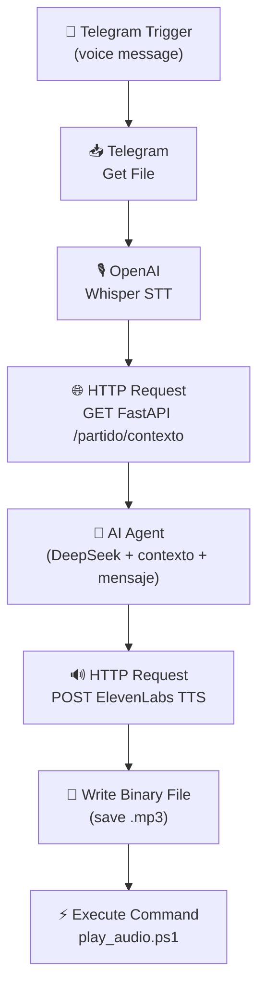
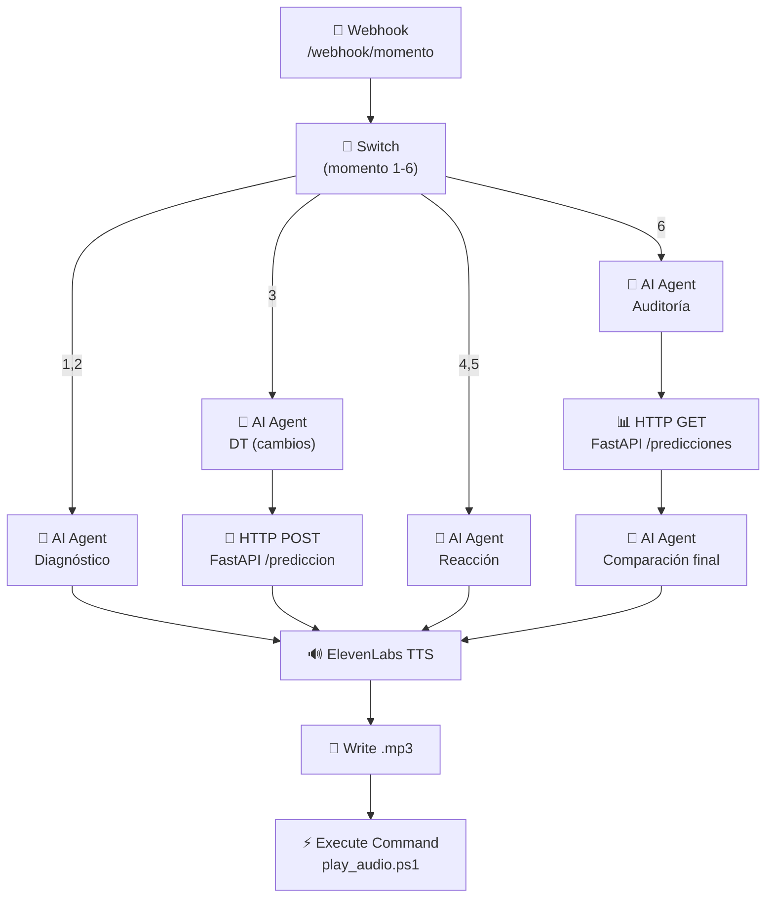
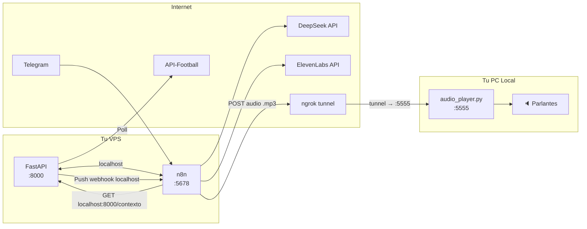

# 🏟️ AI DT — Agente de Comentarios de Fútbol en Vivo (v2)

Un sistema que combina datos en tiempo real de partidos con agentes de IA para generar comentarios con personalidad, responder al usuario en vivo y producir análisis tácticos en 6 momentos clave del partido.

---

## Arquitectura Final



### Stack Definitivo

| Componente | Tecnología | Rol |
|-----------|-----------|-----|
| **Backend de datos** | FastAPI (Python) — **en VPS** | Polling API-Football, estado del partido, mock data |
| **Orquestador + Agentes** | n8n (self-hosted VPS) | Flujos, AI Agent nodes con LangChain, memoria |
| **LLM** | DeepSeek (vía OpenAI-compatible node) | Generación de respuestas y análisis |
| **STT** | OpenAI Whisper (nodo nativo n8n) | Audio → Texto |
| **TTS** | ElevenLabs API (HTTP Request node) | Texto → Audio |
| **Input** | Telegram Bot | Audio del usuario |
| **Audio local** | Python audio_player.py — **en tu PC** | Recibe .mp3 y lo reproduce por parlantes |
| **Datos** | API-Football v3 | Estadísticas en vivo |

### ¿Por qué n8n AI Agent nodes y no OpenCode?

La investigación confirmó que los **nodos AI Agent de n8n** (basados en LangChain) son la opción óptima:

1. **Cero servicios extra** — no hay que levantar OpenCode server ni un wrapper en FastAPI
2. **Memoria nativa** — Postgres/Redis Chat Memory mantiene el contexto de la conversación durante todo el partido usando `sessionId = fixture_{id}`
3. **System prompt = personalidad fija + contexto dinámico** — El nodo AI Agent tiene un campo nativo `System Message` donde va la personalidad e instrucciones fijas. El contexto del partido se inyecta dinámicamente usando expresiones de n8n (`{{ $json.contexto }}`), combinando ambas partes en un solo prompt coherente
4. **DeepSeek compatible** — el nodo "OpenAI-compatible Chat Model" permite setear `https://api.deepseek.com/v1` como base URL
5. **Menor latencia** — llamada directa al LLM, sin hops HTTP intermedios
6. **Routing flexible** — Switch node para los 6 momentos, cada uno con prompt customizado
7. **Ya está corriendo** — n8n ya está en tu VPS, listo para configurar

---

## Estrategia de Datos: Mock → Live

### Fase 1: Mock Data (Argentina vs Holanda, Qatar 2022)

Partido ideal para la demo: tiene goles de ambos lados, empate dramático en el 90+11', sustituciones, tarjetas y penales. Perfecta narrativa para probar los 6 momentos.

El backend incluye un **modo mock** que sirve datos pre-armados simulando la progresión del partido.

> [!IMPORTANT]
> **Los archivos mock replican exactamente el formato JSON de API-Football v3.** El `MatchStateManager` los procesa con la misma lógica de parsing que los datos live. Así, cuando pasemos a producción, no hay que cambiar nada del procesamiento.

```
backend/mock_data/
├── fixture.json          # Estado base del partido (mismo formato que GET /fixtures?id=X)
├── events_15.json        # Eventos hasta min 15 (formato GET /fixtures/events)
├── events_30.json        # Eventos hasta min 30
├── events_ht.json        # Eventos hasta entretiempo
├── events_60.json        # Eventos hasta min 60
├── events_75.json        # Eventos hasta min 75
├── events_ft.json        # Eventos hasta final
├── statistics_15.json    # Stats equipo min 15 (formato GET /fixtures/statistics)
├── statistics_ht.json    # Stats equipo entretiempo
├── statistics_ft.json    # Stats equipo final
├── players_15.json       # Stats jugadores min 15 (formato GET /fixtures/players)
├── players_ht.json       # Stats jugadores entretiempo
└── players_ft.json       # Stats jugadores final
```

Un endpoint `POST /mock/avanzar` permite simular el paso del tiempo manualmente, emulando el comportamiento del polling real para testing end-to-end.

### Fase 2: Live Data (API-Football)

**Optimización del polling para free tier (100 req/día):**

| Endpoint | Intervalo | Requests/partido (~95 min) |
|----------|----------|---------------------------|
| `/fixtures?id=X` (score, minuto, status) | 60 seg | ~95 |
| `/fixtures/events?fixture=X` | Solo en hitos (6 veces) | 6 |
| `/fixtures/statistics?fixture=X` | Solo en hitos (6 veces) | 6 |
| `/fixtures/players?fixture=X` | Solo en hitos (6 veces) | 6 |
| **Total** | | **~113** |

> [!WARNING]
> 113 requests excede ligeramente el free tier de 100. Opciones:
> - Subir el intervalo del fixture a 90 seg (~63 + 18 = **81 requests**) ✅
> - O directamente ir con el plan de $10/mes para no preocuparse

Recomendación: **polling del fixture cada 90 segundos + detalle solo en hitos = ~81 requests**. Entra cómodo en el free tier.

---

## Proposed Changes

### Estructura del Proyecto

```
AI DT/
├── backend/                    # ← DESPLEGADO EN VPS (junto a n8n)
│   ├── main.py                # FastAPI app + polling loop
│   ├── config.py              # Variables de entorno
│   ├── models.py              # Modelos Pydantic
│   ├── services/
│   │   ├── api_football.py    # Cliente API-Football
│   │   ├── match_state.py     # Estado del partido en memoria
│   │   └── milestones.py      # Detección y push de hitos a n8n
│   ├── routers/
│   │   └── partido.py         # Endpoints REST del partido
│   ├── mock_data/             # Datos mock Argentina vs Holanda (formato API-Football v3)
│   │   └── *.json
│   ├── requirements.txt
│   └── .env.example
├── audio_player/               # ← CORRE EN TU PC LOCAL
│   ├── player.py              # Servidor HTTP mínimo que recibe .mp3 y lo reproduce
│   └── requirements.txt       # playsound o pygame
├── n8n/
│   └── README.md              # Guía completa para armar los flujos
└── README.md
```

> [!NOTE]
> **Diferencia clave con v1**: Ya no hay `services/agent.py` ni `prompts/`. Toda la lógica de agentes vive en los nodos AI Agent de n8n. FastAPI es puramente un servicio de datos.

---

### 1. Backend — FastAPI (Solo Datos)

#### [NEW] [config.py](file:///c:/Users/Nahuel/Desktop/AI%20DT/backend/config.py)
- Variables de entorno:
  - `API_FOOTBALL_KEY` — API key de API-Football
  - `FIXTURE_ID` — ID del partido a seguir
  - `N8N_WEBHOOK_BASE_URL` — URL base de los webhooks de n8n (ej: `https://tu-vps.com/webhook`)
  - `MOCK_MODE` — `true` para usar datos mock, `false` para live
  - `POLLING_INTERVAL` — segundos entre polls (default: 90)

#### [NEW] [models.py](file:///c:/Users/Nahuel/Desktop/AI%20DT/backend/models.py)

```python
# Modelos principales
class FixtureStatus:
    elapsed: int          # minuto actual
    short: str            # "1H", "HT", "2H", "FT"
    long: str             # "First Half", "Halftime", etc.

class TeamScore:
    id: int
    name: str
    goals: int

class MatchEvent:
    minute: int
    team: str
    player: str
    type: str             # "Goal", "Card", "subst"
    detail: str           # "Normal Goal", "Yellow Card", "Substitution 1"
    assist: str | None

class PlayerStats:
    name: str
    position: str
    rating: str           # "7.2"
    minutes: int
    goals: int
    assists: int
    shots_total: int
    shots_on: int
    passes_total: int
    key_passes: int
    pass_accuracy: str
    duels_won: int
    duels_total: int
    dribbles_success: int
    dribbles_attempts: int
    fouls_committed: int
    fouls_drawn: int
    yellow_cards: int
    red_cards: int
    substitute: bool

class TeamStats:
    name: str
    possession: str
    shots_on_goal: int
    total_shots: int
    corners: int
    fouls: int
    offsides: int
    yellow_cards: int
    red_cards: int
    pass_accuracy: str
    expected_goals: str

class MatchState:
    fixture_id: int
    status: FixtureStatus
    home: TeamScore
    away: TeamScore
    events: list[MatchEvent]
    home_stats: TeamStats | None
    away_stats: TeamStats | None
    home_players: list[PlayerStats]
    away_players: list[PlayerStats]
    last_updated: datetime

class Prediction:           # Para Momento 3 → Momento 6 comparación
    momento: int
    timestamp: datetime
    content: str            # Texto completo de la recomendación de la IA
```

#### [NEW] [services/api_football.py](file:///c:/Users/Nahuel/Desktop/AI%20DT/backend/services/api_football.py)
- `APIFootballClient`:
  - `async fetch_fixture(fixture_id)` → Parsea fixture, score, status
  - `async fetch_events(fixture_id)` → Parsea eventos
  - `async fetch_statistics(fixture_id)` → Parsea stats de equipo
  - `async fetch_players(fixture_id)` → Parsea stats de jugadores
  - Headers: `{"x-apisports-key": API_KEY}`
  - Base URL: `https://v3.football.api-sports.io/`
  - Tracking de requests usados (contador interno)

#### [NEW] [services/match_state.py](file:///c:/Users/Nahuel/Desktop/AI%20DT/backend/services/match_state.py)
- `MatchStateManager`:
  - Almacena `MatchState` actual en memoria
  - `update_fixture(data)` — actualiza score y status
  - `update_details(events, stats, players)` — actualiza detalle completo
  - `get_state()` → `MatchState` completo
  - `get_context_text()` → Genera un **resumen en texto natural** del estado:
    ```
    ⚽ Argentina 2 - 1 Holanda | Minuto 67 | 2do Tiempo
    
    GOLES: Molina (35'), Messi (pen 73') - Weghorst (83')
    
    POSESIÓN: ARG 44% - HOL 56%
    TIROS AL ARCO: ARG 4 - HOL 5
    xG: ARG 1.78 - HOL 2.33
    
    JUGADORES DESTACADOS (por rating):
    - Messi (8.2) - 1 asistencia, 6/9 regates, 4 pases clave
    - Molina (7.8) - 1 gol, 87% pases
    
    JUGADORES FLOJOS:
    - Martínez (6.1) - 0 goles, 2 offside, 0/2 regates
    
    CAMBIOS REALIZADOS: Martínez → Paredes (82')
    TARJETAS: Montiel 🟨 (78')
    ```
  - `save_prediction(momento, content)` — Guarda predicción de IA
  - `get_predictions()` → Lista de predicciones guardadas
  - **Modo mock**: Lee de archivos JSON según minuto simulado

#### [NEW] [services/milestones.py](file:///c:/Users/Nahuel/Desktop/AI%20DT/backend/services/milestones.py)
- `MilestoneDetector`:
  - Set de hitos disparados: `{1: False, 2: False, ..., 6: False}`
  - `async check_and_push(match_state)`:
    - Si `elapsed >= 15` y no disparado → fetch detail + push `POST {N8N_URL}/webhook/momento` con `{momento: 1, ...data}`
    - Si `elapsed >= 30` → momento 2
    - Si `status == "HT"` → momento 3
    - Si `elapsed >= 60` → momento 4
    - Si `elapsed >= 75` → momento 5
    - Si `status == "FT"` → momento 6
  - Cada push incluye el `context_text` + `match_state` completo
  - Antes de pushear, hace fetch de endpoints detallados (events, stats, players)

#### [NEW] [main.py](file:///c:/Users/Nahuel/Desktop/AI%20DT/backend/main.py)

```python
# Estructura principal
app = FastAPI(title="AI DT Backend")

@asynccontextmanager
async def lifespan(app):
    # Startup: iniciar polling loop
    task = asyncio.create_task(polling_loop())
    yield
    # Shutdown: cancelar polling
    task.cancel()

async def polling_loop():
    while True:
        if MOCK_MODE:
            # En mock, no pollea — espera trigger manual
            await asyncio.sleep(1)
            continue
        
        # Fetch fixture (score, minuto, status)
        data = await api_client.fetch_fixture(FIXTURE_ID)
        match_state.update_fixture(data)
        
        # Verificar hitos (esto fetchea detalle internamente si toca)
        await milestone_detector.check_and_push(match_state)
        
        await asyncio.sleep(POLLING_INTERVAL)
```

**Endpoints:**

| Método | Endpoint | Descripción |
|--------|----------|-------------|
| `GET` | `/health` | Health check |
| `GET` | `/partido/estado` | Estado completo (JSON) |
| `GET` | `/partido/contexto` | Contexto en texto natural (para inyectar en prompt) |
| `GET` | `/partido/predicciones` | Predicciones guardadas de la IA |
| `POST` | `/partido/prediccion` | Guardar predicción `{momento, content}` |
| `POST` | `/mock/avanzar` | (Solo mock) Avanzar al siguiente hito `{momento: int}` |
| `POST` | `/mock/set-minute` | (Solo mock) Setear minuto específico |
| `GET` | `/stats/requests` | Contador de requests a API-Football |

#### [NEW] [routers/partido.py](file:///c:/Users/Nahuel/Desktop/AI%20DT/backend/routers/partido.py)
- Implementación de los endpoints de partido en router separado

---

### 2. Mock Data — Argentina vs Holanda (Qatar 2022)

#### [NEW] `backend/mock_data/*.json`

Datos realistas del partido Argentina 2-2 Holanda (3-4 pen), Quarter-final Qatar 2022:

- **Fixture ID**: 868019
- **Narrativa del partido**:
  - Min 35: Gol Molina (asist. Messi) → ARG 1-0
  - Min 40+3: Gol Messi (penal) → ARG 2-0
  - Min 73: Gol Weghorst → ARG 2-1
  - Min 82: Sale Lautaro, entra Paredes
  - Min 90+11: Gol Weghorst (tiro libre) → ARG 2-2

Cada archivo JSON replica la estructura exacta de respuesta de API-Football v3.

---

### 3. Audio Player Local

#### [NEW] [audio_player/player.py](file:///c:/Users/Nahuel/Desktop/AI%20DT/audio_player/player.py)

Servidor HTTP mínimo (~30 líneas) que corre en tu PC local:
- Escucha en `http://localhost:5555/play`
- Recibe un POST con el archivo `.mp3` en el body
- Lo guarda en un archivo temporal y lo reproduce por los parlantes del sistema
- Usa `pygame.mixer` o `playsound` para la reproducción
- Se expone al internet vía **ngrok**: `ngrok http 5555`
- n8n (desde la VPS) le hace POST con el audio generado por ElevenLabs

```python
from flask import Flask, request
import tempfile, os, subprocess

app = Flask(__name__)

@app.route("/play", methods=["POST"])
def play():
    audio_data = request.get_data()
    path = os.path.join(tempfile.gettempdir(), "ai_dt_audio.mp3")
    with open(path, "wb") as f:
        f.write(audio_data)
    # Reproducir con PowerShell MediaPlayer
    subprocess.Popen([
        "powershell", "-Command",
        f"Add-Type -AssemblyName presentationCore; "
        f"$p = New-Object System.Windows.Media.MediaPlayer; "
        f"$p.Open('{path}'); $p.Play(); "
        f"Start-Sleep -Seconds 20; $p.Close()"
    ])
    return {"status": "playing"}

if __name__ == "__main__":
    app.run(host="0.0.0.0", port=5555)
```

#### [NEW] [audio_player/requirements.txt](file:///c:/Users/Nahuel/Desktop/AI%20DT/audio_player/requirements.txt)
```
flask
```

---

### 4. Flujos n8n (Documentación Detallada)

#### [NEW] [n8n/README.md](file:///c:/Users/Nahuel/Desktop/AI%20DT/n8n/README.md)

##### Prerequisitos
1. **Bot de Telegram**: Crear con @BotFather → obtener token
2. **Credenciales en n8n**:
   - Telegram Bot API (token)
   - OpenAI API (para Whisper STT)
   - DeepSeek API key (para AI Agent)
   - ElevenLabs API key (para TTS)
3. **Nodos necesarios**:
   - Telegram Trigger + Telegram (nativos)
   - OpenAI (nativo — para Whisper)
   - AI Agent + OpenAI-compatible Chat Model (nativos)
   - HTTP Request (nativo — para ElevenLabs y FastAPI)
   - Execute Command (nativo — para audio local)
   - Switch (nativo — para routing de momentos)

##### Flujo 1: Capa Dinámica (Interacción en Vivo)



**Configuración del AI Agent node:**
- **Chat Model**: OpenAI-compatible → Base URL: `https://api.deepseek.com/v1` → Model: `deepseek-chat`
- **Memory**: Postgres Chat Memory → sessionId: `dinamico_{{ $json.fixture_id }}`
- **System Prompt (campo nativo del nodo AI Agent)**:
  ```
  # PERSONALIDAD (fija)
  Sos un analista de fútbol argentino. Hablás en español rioplatense.
  Sos apasionado, directo y usás datos reales para respaldar tus opiniones.
  Respondé de forma concisa (máximo 3-4 oraciones) porque tu respuesta va a ser 
  leída en voz alta.
  
  # INSTRUCCIONES (fijas)
  - Siempre mencioná datos concretos cuando opines sobre un jugador.
  - Si no tenés datos de algo, decilo honestamente.
  - Tu tono es el de un amigo viendo el partido, no un robot.
  
  # CONTEXTO DEL PARTIDO (dinámico — inyectado via expresión n8n)
  {{ $('HTTP Request Contexto').item.json.contexto }}
  ```

> [!NOTE]
> La parte de personalidad e instrucciones es **fija** (siempre la misma). El bloque de contexto se actualiza dinámicamente en cada ejecución con la expresión `{{ }}` de n8n, que trae el texto natural desde FastAPI `/partido/contexto`.

##### Flujo 2: Capa de Análisis (6 Hitos)



**System prompts por momento:**

| Momento | Trigger | System Prompt (resumen) |
|---------|---------|------------------------|
| 1 (Min 15) | `elapsed >= 15` | "Primeras impresiones. ¿Cómo se paró cada equipo? ¿Quién domina? ¿Dónde hay espacios?" |
| 2 (Min 30) | `elapsed >= 30` | "Diagnóstico táctico. ¿Quién rinde y quién no? ¿Riesgos? ¿Tendencias?" |
| 3 (Entretiempo) | `status == HT` | "Sos el DT. ¿Qué cambios hacés? ¿Quién sale? ¿Quién entra? ¿Cambio táctico? Analizá el arbitraje." |
| 4 (Min 60) | `elapsed >= 60` | "¿Cambió algo tras el entretiempo? ¿Se hicieron los cambios que recomendaste?" |
| 5 (Min 75) | `elapsed >= 75` | "Recta final. ¿Quién tiene más nafta? ¿Últimos cambios necesarios?" |
| 6 (Final) | `status == FT` | "Auditoría completa. Compará tus predicciones del entretiempo con lo que pasó. ¿Quién tuvo razón, vos o el DT real?" |

**Momento 3 → 6 (la magia):**
- En momento 3, la respuesta del AI Agent se guarda vía `POST /partido/prediccion`
- En momento 6, antes de llamar al AI Agent, se hace `GET /partido/predicciones` y se inyecta como contexto extra:
  ```
  LO QUE RECOMENDASTE EN EL ENTRETIEMPO:
  {{ $('HTTP Request Predicciones').item.json.predictions }}
  
  LO QUE REALMENTE PASÓ:
  {{ $('HTTP Request Estado').item.json.contexto }}
  
  Analizá quién tuvo razón: vos o el DT real. Sé honesto.
  ```

##### Paso previo: Crear Bot de Telegram

1. Abrir Telegram → buscar `@BotFather`
2. Enviar `/newbot`
3. Elegir nombre: "AI DT Bot" 
4. Elegir username: `ai_dt_nahuel_bot` (tiene que terminar en `_bot`)
5. Copiar el token → pegar en credenciales de n8n
6. Enviar `/setprivacy` → seleccionar el bot → `Disable` (para que reciba todos los mensajes)

---

## Arquitectura de Deployment



### ¿Por qué FastAPI en la VPS?

- **FastAPI y n8n en la misma VPS** = comunicación por `localhost`, cero latencia, cero tunnels para datos
- FastAPI pushea hitos a `http://localhost:5678/webhook/momento` (n8n) directamente
- n8n consulta contexto en `http://localhost:8000/partido/contexto` directamente
- **Solo necesitás ngrok para una cosa**: exponer el `audio_player.py` de tu PC local para que n8n le envíe el audio

### Setup de ngrok (solo para audio)

En tu PC local:
```bash
# Terminal 1: levantar el audio player
python audio_player/player.py

# Terminal 2: exponer con ngrok
ngrok http 5555
# Esto te da una URL tipo: https://abc123.ngrok-free.app
```

Esa URL de ngrok se configura como variable de entorno en n8n: `AUDIO_PLAYER_URL=https://abc123.ngrok-free.app/play`

> [!TIP]
> **El flujo de audio**: n8n genera el .mp3 con ElevenLabs → lo envía via POST al audio player local (vía ngrok) → el audio suena por tus parlantes **al instante** que se genera. Latencia total: ~1-2 segundos extra por el tunnel.

---

## Verification Plan

### Fase 1 — Backend con Mock Data
```bash
cd backend
pip install -r requirements.txt
# Setear MOCK_MODE=true en .env
uvicorn main:app --reload --port 8000

# Verificar endpoints:
# GET http://localhost:8000/health
# POST http://localhost:8000/mock/avanzar {"momento": 1}
# GET http://localhost:8000/partido/estado
# GET http://localhost:8000/partido/contexto
```

### Fase 2 — Audio Local
```powershell
# Probar script de audio con un .mp3 de prueba
.\scripts\play_audio.ps1 -FilePath "test.mp3"
```

### Fase 3 — n8n Flujo Dinámico
1. Crear bot de Telegram
2. Armar flujo en n8n: Telegram → Whisper → HTTP FastAPI → AI Agent → ElevenLabs → audio
3. Enviar audio de prueba por Telegram
4. Verificar que el audio suena por los parlantes

### Fase 4 — n8n Flujo de Análisis
1. Armar flujo con webhook + Switch + 6 AI Agents
2. Usar `POST /mock/avanzar` para simular los hitos
3. Verificar que cada momento genera análisis correcto
4. Verificar que momento 3 guarda predicción y momento 6 la compara

### Fase 5 — Partido en Vivo
1. Setear `MOCK_MODE=false` y `FIXTURE_ID` del partido
2. Correr durante un partido real
3. Verificar polling, hitos, y respuestas en vivo

---

## Orden de Implementación

| Paso | Componente | Dónde | Descripción |
|------|-----------|-------|-------------|
| 1 | `config.py` + `models.py` + `.env.example` + `requirements.txt` | VPS | Fundación del proyecto |
| 2 | `mock_data/*.json` | VPS | Dataset Argentina vs Holanda (formato API-Football v3) |
| 3 | `services/match_state.py` | VPS | Estado en memoria + modo mock |
| 4 | `services/api_football.py` | VPS | Cliente API-Football |
| 5 | `services/milestones.py` | VPS | Detección y push de hitos |
| 6 | `routers/partido.py` + `main.py` | VPS | API REST + polling loop |
| 7 | `audio_player/player.py` | PC Local | Servidor de audio (~30 líneas) |
| 8 | `n8n/README.md` | — | Guía detallada de configuración de flujos |
| 9 | `README.md` | — | Documentación general del proyecto |
