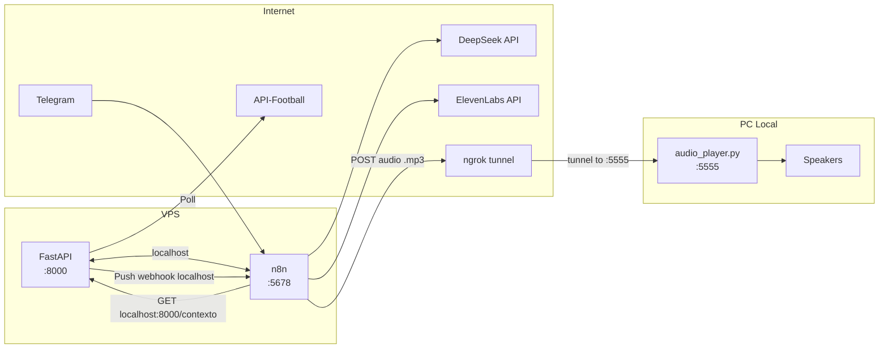
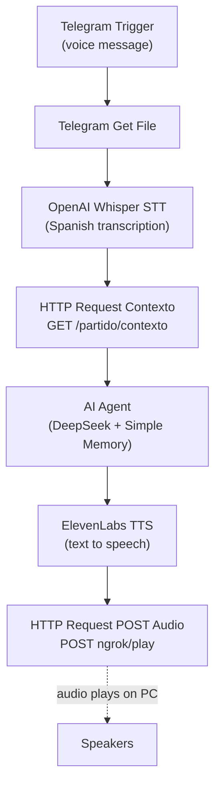
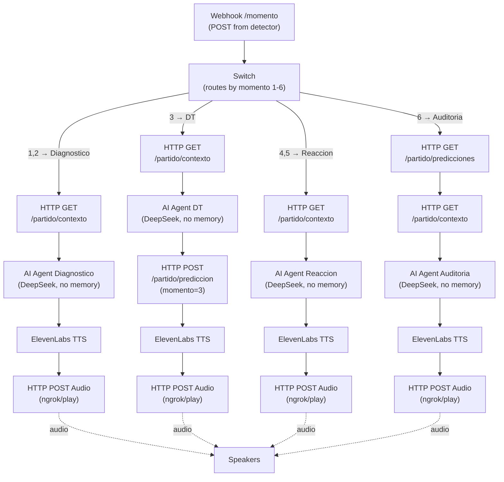

# AI DT — n8n Workflows Setup Guide

This guide covers everything needed to configure and test the two n8n workflows that power the AI DT (Dynamic & Analysis Layers) system.

## Workflows Overview

| Flow | Name | ID | Trigger | Purpose |
|------|------|----|---------|---------|
| 1 | AI DT - Dynamic Layer | `DmefWwt2uWOrNvZD` | Telegram voice message | Live interaction: STT → AI Agent (with memory) → TTS → audio playback |
| 2 | AI DT - Analysis Layer | `p6VSRSmzuU9KKmRb` | Webhook POST `/momento` | 6-milestone match analysis: webhook → Switch routing → stateless AI Agents → TTS → audio |

Both workflows are created **inactive** in n8n project `p3bjSbaomjjaHR3z` on instance `https://n8n.nrlabs.com.ar`.

---

## Architecture Diagram



**Why FastAPI and n8n on the same VPS**: Communication is via `localhost` — zero latency, zero tunnels for data. FastAPI pushes milestones to `http://localhost:5678/webhook/momento` (n8n) directly. n8n queries context at `http://localhost:8000/partido/contexto` directly. The **only** thing that needs ngrok is exposing `audio_player.py` on your local PC so n8n can send audio to your speakers.

---

## 1. Prerequisites

| # | Requirement | Details |
|---|-------------|---------|
| 1 | Telegram Bot | Created via @BotFather (see [Telegram Bot Setup](#3-telegram-bot-setup)) |
| 2 | n8n credentials | 4 API credentials (see [Credentials Setup](#2-credentials-setup)) |
| 3 | ngrok | For exposing the local audio player to the VPS |
| 4 | FastAPI backend | Running on `:8000` (mock mode for testing) |
| 5 | audio_player.py | Running on `:5555` (local PC, see [Ngrok Setup](#6-ngrok-setup)) |

---

## 2. Credentials Setup

Create these 4 credentials manually in the n8n UI under **Settings → Credentials**:

| Credential | n8n Type | Where to Get It |
|------------|----------|-----------------|
| Telegram Bot API | `telegramApi` | @BotFather token (see [Telegram Bot Setup](#3-telegram-bot-setup)) |
| OpenAI API | `openAiApi` | platform.openai.com → API Keys |
| DeepSeek API | `deepSeekApi` | platform.deepseek.com → API Keys |
| ElevenLabs API | `elevenLabsApi` | elevenlabs.io dashboard → API Keys |

### How to Create a Credential in n8n

1. Open `https://n8n.nrlabs.com.ar` → **Settings** → **Credentials**
2. Click **Add Credential**
3. Search for the credential type (e.g., "Telegram", "OpenAI", "DeepSeek", "ElevenLabs")
4. Fill in the API key/token
5. Save with a descriptive name (e.g., "Telegram Bot", "OpenAI", "DeepSeek", "ElevenLabs")

---

## 3. Telegram Bot Setup

1. Open Telegram and search for `@BotFather`
2. Send `/newbot`
3. Choose a name: `AI DT Bot`
4. Choose a username ending in `_bot` (e.g., `ai_dt_nahuel_bot`)
5. Copy the **token** provided by BotFather
6. Send `/setprivacy` → select your bot → choose **Disable** (so the bot receives all messages in group chats)
7. Paste the token into a new **Telegram Bot API** credential in n8n (see [Credentials Setup](#2-credentials-setup))

---

## 4. Workflow Configuration

### Flow 1: AI DT - Dynamic Layer (`DmefWwt2uWOrNvZD`)

1. Open the workflow in n8n: `https://n8n.nrlabs.com.ar/workflow/DmefWwt2uWOrNvZD`
2. Assign credentials to each node:

   | Node | Credential Type | Credential Name |
   |------|----------------|-----------------|
   | Telegram Trigger | `telegramApi` | Telegram Bot |
   | Telegram Get File | `telegramApi` | Telegram Bot |
   | OpenAI Whisper STT | `openAiApi` | OpenAI |
   | DeepSeek Model (subnode) | `deepSeekApi` | DeepSeek |
   | ElevenLabs TTS | `elevenLabsApi` | ElevenLabs |

3. Set the **ElevenLabs voiceId**: open the ElevenLabs TTS node → select a voice from the dropdown (see [Placeholder Values](#5-placeholder-values))
4. Set the **ngrok audio player URL**: open the "HTTP Request POST Audio" node → replace the placeholder URL (see [Placeholder Values](#5-placeholder-values))

### Flow 2: AI DT - Analysis Layer (`p6VSRSmzuU9KKmRb`)

1. Open the workflow in n8n: `https://n8n.nrlabs.com.ar/workflow/p6VSRSmzuU9KKmRb`
2. Assign credentials to each node:

   | Node(s) | Credential Type | Credential Name |
   |---------|----------------|-----------------|
   | DeepSeek Model Diagnostico (subnode) | `deepSeekApi` | DeepSeek |
   | DeepSeek Model DT (subnode) | `deepSeekApi` | DeepSeek |
   | DeepSeek Model Reaccion (subnode) | `deepSeekApi` | DeepSeek |
   | DeepSeek Model Auditoria (subnode) | `deepSeekApi` | DeepSeek |
   | ElevenLabs TTS Diagnostico | `elevenLabsApi` | ElevenLabs |
   | ElevenLabs TTS DT | `elevenLabsApi` | ElevenLabs |
   | ElevenLabs TTS Reaccion | `elevenLabsApi` | ElevenLabs |
   | ElevenLabs TTS Auditoria | `elevenLabsApi` | ElevenLabs |

3. Set the **ElevenLabs voiceId** in all 4 TTS nodes
4. Set the **ngrok audio player URL** in all 4 "HTTP Request POST Audio" nodes

---

## 5. Placeholder Values

The workflow SDK code uses `placeholder()` for values that must be set manually after workflow creation. These appear as placeholder strings in the n8n UI and must be replaced with real values.

| Placeholder | Node(s) | What to Replace With |
|-------------|---------|----------------------|
| `NGROK_AUDIO_PLAYER_URL` | HTTP Request POST Audio (both flows — 1 in Flow 1, 4 in Flow 2) | Your ngrok HTTPS URL + `/play` (e.g., `https://abc123.ngrok-free.app/play`) |
| `VOICE_ID` | ElevenLabs TTS (both flows — 1 in Flow 1, 4 in Flow 2) | A voice ID from the ElevenLabs dashboard (or select a voice from the n8n UI dropdown) |

### How to Replace Placeholders

1. Open the workflow in n8n
2. Click on the node containing the placeholder
3. Replace the placeholder value in the URL (for ngrok) or voiceId (for ElevenLabs) field
4. The ngrok URL changes every session — update it each time you restart ngrok

---

## 6. Ngrok Setup

The audio player runs on your local PC and must be exposed to the VPS via ngrok so n8n can POST audio to it.

```bash
# Terminal 1: start the audio player
python audio_player/player.py

# Terminal 2: start ngrok tunnel
ngrok http 5555
# Copy the HTTPS URL, e.g.: https://abc123.ngrok-free.app
```

Paste the ngrok URL + `/play` into the "HTTP Request POST Audio" nodes in both workflows:
- Flow 1: 1 node
- Flow 2: 4 nodes

Example: `https://abc123.ngrok-free.app/play`

> The ngrok URL changes every time you restart ngrok. Update the placeholder in all POST Audio nodes after each restart.

---

## 7. Testing Checklist

Follow these 9 steps in order to test the full system end-to-end.

1. [ ] **Start FastAPI backend (mock mode)**:
   ```bash
   cd backend && uvicorn main:app --reload --port 8000
   ```

2. [ ] **Start the audio player**:
   ```bash
   python audio_player/player.py
   ```

3. [ ] **Start ngrok**:
   ```bash
   ngrok http 5555
   ```
   Copy the HTTPS URL.

4. [ ] **Configure credentials** in the n8n UI for both workflows (see [Credentials Setup](#2-credentials-setup)).

5. [ ] **Replace placeholder URLs** in both workflows:
   - ngrok URL + `/play` in all "HTTP Request POST Audio" nodes
   - ElevenLabs voiceId in all "ElevenLabs TTS" nodes

6. [ ] **Activate Flow 1** (Dynamic Layer) in n8n — toggle the workflow to Active.

7. [ ] **Send a voice message** via Telegram to the bot → verify the AI responds and audio plays on your speakers.

8. [ ] **Activate Flow 2** (Analysis Layer) in n8n — toggle the workflow to Active. Then trigger momento 3:
   ```bash
   curl -X POST http://localhost:8000/mock/avanzar -H "Content-Type: application/json" -d '{"momento": 3}'
   ```
   Verify: AI Agent DT commentary plays as audio, and a prediction is saved via `POST /partido/prediccion`.

9. [ ] **Trigger momento 6** to test the prediction audit:
   ```bash
   curl -X POST http://localhost:8000/mock/avanzar -H "Content-Type: application/json" -d '{"momento": 6}'
   ```
   Verify: AI Agent Auditoria compares the entretiempo prediction with the final result, and the comparison plays as audio.

---

## 8. Rollback

To undo the n8n workflow deployment:

1. **Archive both workflows** via the n8n MCP API:
   ```
   archive_workflow(workflowId: "DmefWwt2uWOrNvZD")  # Flow 1 — Dynamic Layer
   archive_workflow(workflowId: "p6VSRSmzuU9KKmRb")  # Flow 2 — Analysis Layer
   ```
   Or archive them from the n8n UI: open each workflow → menu → Archive.

2. **Delete this README**: `rm n8n/README.md`

3. **No backend changes needed** — the FastAPI backend is unaffected. The n8n webhook endpoint (`/webhook/momento`) simply stops receiving responses once workflows are archived.

---

## 9. Flow 1 Diagram — Dynamic Layer



**Data flow**: Telegram voice → STT (Spanish) → context from FastAPI → AI Agent generates response (Rioplatense Spanish, max 3-4 sentences) → TTS generates .mp3 → POST to local audio player via ngrok → audio plays on speakers.

---

## 10. Flow 2 Diagram — Analysis Layer



### Momento Routing

| Momento | Trigger | Guard | AI Agent | Focus | Saves Prediction? |
|---------|---------|-------|----------|-------|-------------------|
| 1 | `elapsed >= 15` | `short == "1H"` | Diagnostico | First impressions, who dominates, spaces | No |
| 2 | `elapsed >= 30` | `short in ("1H","HT","2H")` | Diagnostico | Tactical diagnosis, who performs, risks | No |
| 3 | `short == "HT"` | — | DT | What changes to make, who enters/exits, tactical shift | **Yes** (`POST /partido/prediccion`) |
| 4 | `elapsed >= 60` | `short in ("HT","2H","ET","BT","P","AET","PEN","FT")` | Reaccion | Post-HT reaction, were recommended changes made | No |
| 5 | `elapsed >= 75` | `short in ("2H","ET","BT","P","AET","PEN","FT")` | Reaccion | Final stretch, who has stamina, last changes | No |
| 6 | `short in ("FT","AET","PEN")` | — | Auditoria | Full audit, compare entretiempo predictions vs reality | No (reads prior predictions) |

### Momento 3 → 6 (the magic)

- At **momento 3**, the AI Agent DT response is saved via `POST /partido/prediccion` with `{momento: 3, content: "<AI output>"}`
- At **momento 6**, before the AI Agent runs, `GET /partido/predicciones` fetches all saved predictions and injects them into the Auditoria system prompt for comparison: "Who was right: you or the real DT?"

---

## Webhook Payload

The FastAPI backend (MilestoneDetector) sends this payload to `POST /webhook/momento`:

```json
{
  "momento": 3,
  "context_text": "...natural language match snapshot...",
  "match_state": {
    "home": {},
    "away": {},
    "events": [],
    "status": {},
    "fixture_id": 12345
  }
}
```

The webhook responds with `200 OK` immediately (`responseMode: onReceived`) since the detector has a 5-second timeout. Processing happens asynchronously after the response is sent.
